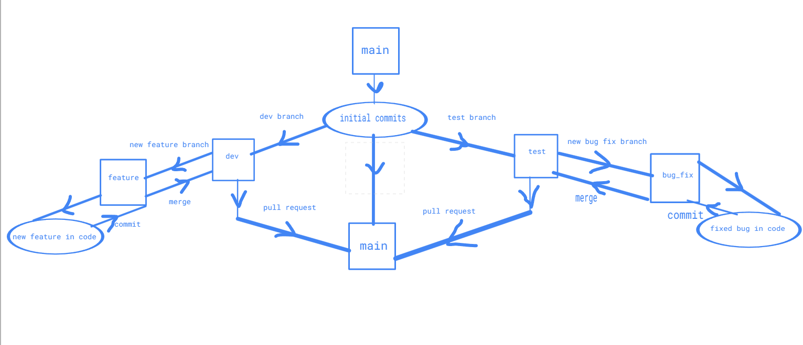

# Branching exercises
contains batch file used to demostrate branching exercises in git

## Workflow

### Feature

a new feature is added to allow the user to confirm whether they want to go ahead with the task in batch file

### Bug

user is not informed how to use the batch file and what arguments to supply, causing the batch file to crash if ran without arguments,it is then fixed in code

### commands used and description

| Command | Description |
| ----------- | ----------- |
| git init | initialises git on the folder where the command is run |
| git –help | shows all the available options for git command |
| git config --list | lists all the configuration options available for git |
| git status | shows the status of repository like any files to be added or committed |
| git add filename | stages the file so that it can be tracked |
| git restore filename | revert back changes to the file to the original state before committing |
| git commit -m “First Commit” | commits changes to all the tracked files in the repo. -m lets us add a message about the commit |
| git diff filename | shows the differences between a staged file and the original file |
| git log | shows all the commit history of the repo,-n switch lets us view only the last n commits |
| git tag -a v0.1 -m "Alpha release 1" | used to mark release points in the repo |
| git blame filename | used to find out who worked on a particular file and what they did |
| git revert HEAD | Reverts the repo to previous committed version,replace HEAD with hash of the commit to revert to that particular commit |
| .gitignore file | keep the files to be ignored in a repository in the gitignore files,usefull for ignoring config or setup files |
| git stash | when you want to record the current state of the working directory and the index, but want to go back to a clean working directory |
| git branch | list all the branches for your project |
| git pull | syncs local repo with github repo |
| git push | syncs github repo with local repo |
| git clone url | gets a copy of a remote github repo on the local machine |
| git remote add url | adds a remote github repo to then sync the local repo |
| git checkout filename or git restore filename | revert only the file mentioned to a previous committed version |
| git branch branchname | creates a new branch from the current branch |
| git checkout branchname | switches to the named branch |
| git branch -d branchname | deletes the named branch locally |
| git push origin –delete branchname | deletes the named branch on remote repo |
| git push –set-upstream origin branchname | creates the named branch on the remote repo |
| git merge branchname | merges the changes in the named branch to the current branch |
| pull requests on github | used to sync the changes in dev or test branches to main branch containing stable code |